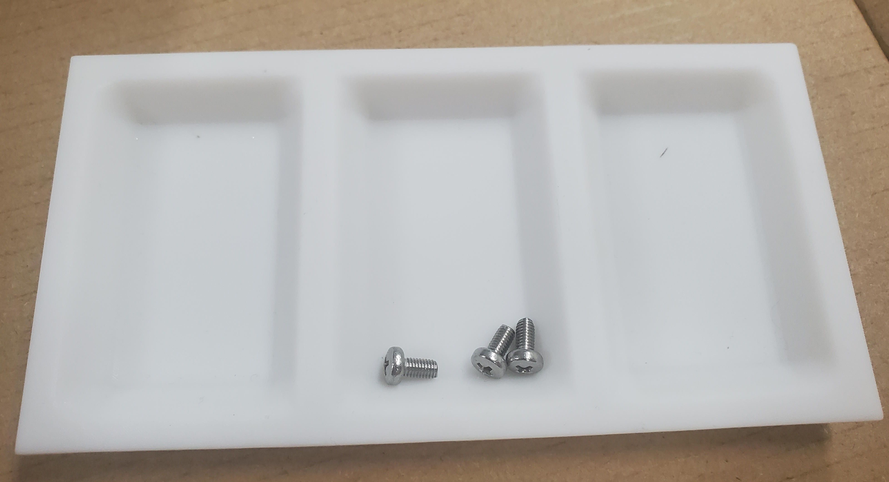

# Small components holder

Designed for holding surface mount resistors while soldering PCBs. Probably useful for other small bits and bobs. Intended to be 3D printed.

Photo of v1.1 holder with three M3x6mm screws sitting in it.
